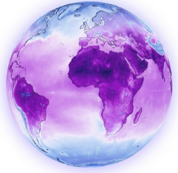

# Sesión 4: Generación de Mapas, Zonificación Agroclimática y Definición de Ambientes (TPE)

**Fecha:** Miércoles 25 de marzo · 9:00 – 11:00 am (hora Honduras)  
**Duración:** 2 horas

---

## Material de la Sesión

Todos los archivos de datos, scripts y recursos necesarios para esta sesión están disponibles en Google Drive:

  <a href="https://drive.google.com/drive/folders/1U_lgC-TuKmmhJJCfv7ThsWzlur4fT9As?usp=drive_link"
     target="_blank"
     style="display: inline-flex; align-items: center; gap: 10px;
            background: #1a73e8; color: white; font-weight: 600;
            padding: 14px 28px; border-radius: 8px; text-decoration: none;
            font-size: 1rem; box-shadow: 0 2px 8px rgba(0,0,0,0.18);">
    📁 Acceder al material en Google Drive
  </a>

## Descripción General

En esta sesión final integramos todos los indicadores agroclimáticos calculados en las sesiones anteriores para producir mapas temáticos, clasificar los ambientes de producción de frijol en Honduras y traducir los resultados en recomendaciones concretas para el mejoramiento genético.

## Agenda (120 minutos)

| Duración | Componente |
|----------|-----------|
| 30 min | Insumos faltantes |
| 30 min | [Zonificación](mapas_tpe.md) |
| 30 min | [Estadística Zonal](estadistica_zonal.md) |
| 30 min | Práctica |

---

## Resultados de Aprendizaje

Al finalizar esta sesión, los participantes serán capaces de:

- Construir mapas cartográficos de los indicadores agroclimático.
- Realizar una **clasificación edato-climáticas** mediante agrupación K-Means.
- Calcular **estadística zonal** para resumir los indicadores a nivel departamental.
- Sintetizar los resultados en recomendaciones.

---

## Requisitos Previos

!!! warning "Requisitos técnicos"
    Para sacar el máximo provecho del taller se recomienda:

    - Haber completado los scripts de las Sesiones 2 y 3 para que los archivos `.tif` de indicadores estén disponibles

---

## Presentación de la Sesión

[📥 Descargar presentación (PDF)](https://github.com/cbarriosperez/Taller_IndicesAgroclimaticos_Frijol/raw/main/docs/Presentations/Sesion4_Zonificacion%20en%20R.pdf){ download }

